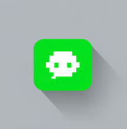

<!-- Improved compatibility of back to top link: See: https://github.com/othneildrew/Best-README-Template/pull/73 -->
<a id="readme-top"></a>


<!-- PROJECT SHIELDS -->
<!--
*** I'm using markdown "reference style" links for readability.
*** Reference links are enclosed in brackets [ ] instead of parentheses ( ).
*** See the bottom of this document for the declaration of the reference variables
*** for contributors-url, forks-url, etc. This is an optional, concise syntax you may use.
*** https://www.markdownguide.org/basic-syntax/#reference-style-links
-->
[![Contributors][contributors-shield]][contributors-url]
[![Forks][forks-shield]][forks-url]
[![Stargazers][stars-shield]][stars-url]
[![Issues][issues-shield]][issues-url]
[![MIT License][license-shield]][license-url]


<!-- PROJECT LOGO -->
<br />
<div align="center">
  <a href="https://github.com/User-Avatar-BackEnd/UserAvatar">
    
  </a>

<h3 align="center">User Avatar</h3>

  <p align="center">
    A user engagement system that leverages behavioral analysis and gamification to provide personalized recommendations for optimal app usage.
    <br />
    <a href="https://github.com/User-Avatar-BackEnd/UserAvatar"><strong>Explore the docs »</strong></a>
    <br />
    <br />
    <a href="https://github.com/User-Avatar-BackEnd/UserAvatar">View Documentation</a>
    ·
    <a href="https://github.com/User-Avatar-BackEnd/UserAvatar/issues/new?labels=bug&template=bug-report---.md">Report Bug</a>
    ·
    <a href="https://github.com/User-Avatar-BackEnd/UserAvatar/issues/new?labels=enhancement&template=feature-request---.md">Request Feature</a>
  </p>
</div>


<!-- TABLE OF CONTENTS -->
<details>
  <summary>Table of Contents</summary>
  <ol>
    <li>
      <a href="#about-the-project">About The Project</a>
      <ul>
        <li><a href="#built-with">Built With</a></li>
      </ul>
    </li>
    <li>
      <a href="#getting-started">Getting Started</a>
      <ul>
        <li><a href="#prerequisites">Prerequisites</a></li>
        <li><a href="#installation">Installation</a></li>
      </ul>
    </li>
    <li><a href="#usage">Usage</a></li>
    <li><a href="#roadmap">Roadmap</a></li>
    <li><a href="#contributing">Contributing</a></li>
    <li><a href="#license">License</a></li>
    <li><a href="#contact">Contact</a></li>
    <li><a href="#acknowledgments">Acknowledgments</a></li>
  </ol>
</details>

<!-- ABOUT THE PROJECT -->
## About The Project

[](https://youtu.be/i5eKNAdw8MI)

This project aims to revolutionize user engagement in applications through advanced behavioral analysis and gamification techniques.
By closely monitoring and analyzing user interactions during each session, we create a unique "behavioral avatar" for every user.
This avatar serves as a digital representation of the user's habits, preferences, and patterns within the app.
The system then uses this data to recommend optimal behavior patterns, encouraging users to engage with the application in ways that are most beneficial and enjoyable for them. By incorporating gamification elements, we transform routine interactions into rewarding experiences, motivating users to explore new features and maintain consistent usage.

Key features of the project include:

- Real-time session tracking and analysis;
- Creation of individualized behavioral avatars;
- Recommendation engine for suggesting optimal usage patterns;
- Gamification elements to incentivize desired behaviors;
- Personalized user experience based on behavioral insights;

By combining these elements, we aim to significantly boost user engagement, retention, and satisfaction while providing valuable insights for continuous app improvement.

<p align="right">(<a href="#readme-top">back to top</a>)</p>


### Built With

* [![.NET][.NET]][.NET]

<p align="right">(<a href="#readme-top">back to top</a>)</p>


<!-- GETTING STARTED -->
## Getting Started

Welcome to the User Avatar back-end! Follow these steps to get started:
### Prerequisites

- Install [.NET SDK](https://dotnet.microsoft.com/en-us/download) (version 8.0 or later)

### Installation

1. **Clone the Repository**
    ```shell
   git clone https://github.com/User-Avatar-BackEnd/UserAvatar.git
   cd .\src\main
   ```


2. **Build the Solution**
    ```shell
   dotnet build
   ```

3. **Run Benchmarks.** Navigate to a specific benchmark project and run:
    ```shell
   dotnet run -c Release
   ```
<p align="right">(<a href="#readme-top">back to top</a>)</p>


If you have any questions or suggestions, please open an issue in the repository.


<!-- CONTRIBUTING -->
## Contributing

Contributions are what make the open source community such an amazing place to learn, inspire, and create. Any contributions you make are **greatly appreciated**.

If you have a suggestion that would make this better, please fork the repo and create a pull request. You can also simply open an issue with the tag "enhancement".
Don't forget to give the project a star! Thanks again!

1. Fork the Project
2. Create your Feature Branch (`git checkout -b feature/AmazingFeature`)
3. Commit your Changes (`git commit -m 'Add some AmazingFeature'`)
4. Push to the Branch (`git push origin feature/AmazingFeature`)
5. Open a Pull Request

<!-- LICENSE -->
## License

Distributed under the MIT License. See `LICENSE.txt` for more information.

<p align="right">(<a href="#readme-top">back to top</a>)</p>

<!-- CONTACT -->
## Contact

- Daniil Panasenko - [@DaniilPanasenko](https://github.com/DaniilPanasenko)
- Karyna Bilotska - [@kkkars](https://github.com/kkkars)
- Ihor Volokhovych - [@antomys](https://github.com/antomys)

Project Link: [https://github.com/User-Avatar-BackEnd/UserAvatar](https://github.com/User-Avatar-BackEnd/UserAvatar)

<p align="right">(<a href="#readme-top">back to top</a>)</p>


<!-- MARKDOWN LINKS & IMAGES -->
<!-- https://www.markdownguide.org/basic-syntax/#reference-style-links -->
[contributors-shield]: https://img.shields.io/github/contributors/User-Avatar-BackEnd/UserAvatar.svg?style=for-the-badge
[contributors-url]: https://github.com/User-Avatar-BackEnd/UserAvatar/graphs/contributors
[forks-shield]: https://img.shields.io/github/forks/User-Avatar-BackEnd/UserAvatar.svg?style=for-the-badge
[forks-url]: https://github.com/User-Avatar-BackEnd/UserAvatar/network/members
[stars-shield]: https://img.shields.io/github/stars/User-Avatar-BackEnd/UserAvatar.svg?style=for-the-badge
[stars-url]: https://github.com/User-Avatar-BackEnd/UserAvatar/stargazers
[issues-shield]: https://img.shields.io/github/issues/User-Avatar-BackEnd/UserAvatar.svg?style=for-the-badge
[issues-url]: https://github.com/User-Avatar-BackEnd/UserAvatar/issues
[license-shield]: https://img.shields.io/github/license/User-Avatar-BackEnd/UserAvatar.svg?style=for-the-badge
[license-url]: https://github.com/User-Avatar-BackEnd/UserAvatar/blob/master/LICENSE
[.NET]: https://img.shields.io/badge/-.NET%208.0-blueviolet
